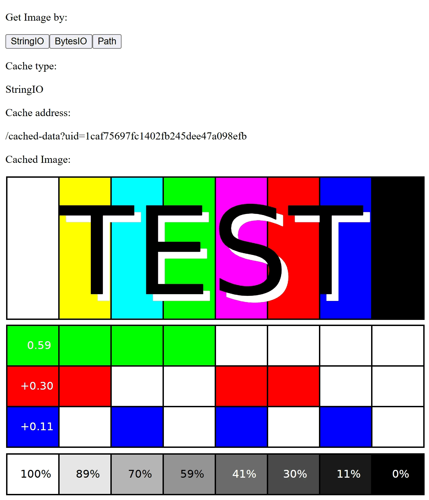

import mdiLanguagePython from "@iconify-icons/mdi/language-python";

import { demoURL } from "@site/src/envs/variables";
import DarkButton from "@site/src/components/DarkButton";

# Examples of different types of caches

<div className="float-right indark-inv">

|            Example of using different cache types            |
| :----------------------------------------------------------: |
|  |

</div>

We provide three demos to show the usage of different kinds of caches:

<p>
  <DarkButton to={demoURL("single_process.py")} icon={mdiLanguagePython}>
    {"single_process.py"}
  </DarkButton>
</p>

<p>
  <DarkButton to={demoURL("background_callback.py")} icon={mdiLanguagePython}>
    {"background_callback.py"}
  </DarkButton>
</p>

<p>
  <DarkButton to={demoURL("tempfile_cache.py")} icon={mdiLanguagePython}>
    {"tempfile_cache.py"}
  </DarkButton>
</p>

<div className="d-flow-root">

:::info

To run the examples with background callbacks, please install the optional dependencies
by

```shell
python -m pip install dash[diskcache]
```

:::

</div>

These demos implement the following equivalent functionalities.

1. Provide three buttons: <kbd>StringIO</kbd>, <kbd>BytesIO</kbd>, and <kbd>Path</kbd>.
   1. By clicking <kbd>StringIO</kbd>, the `svg` image will be loaded as text and sent
      to the frontend.
   2. By clicking <kbd>BytesIO</kbd>, the `svg` image will be loaded as raw bytes data
      and sent to the frontend.
   3. By clicking <kbd>StringIO</kbd>, the path to the `svg` image will be cached and
      the data will be loaded and sent to the frontend.
2. When the button is clicked, the type of the data source, the address of the cached
   data, and the loaded image will be displayed.
3. For demos powered by `background_callbacks`, we deliberately make the callback wait
   shortly. During the running of the callback, i.e. the preparation of the image, the
   progress will be displayed.

## Define the layout

Take `single_process.py` as an example, the layout of the demo is defined as follows

```python showLineNumbers
html.Div(
    (
        html.Div(
            (
                html.P("Get Image by:"),
                html.Button(id="btn-strio", children="StringIO"),
                html.Button(id="btn-bytesio", children="BytesIO"),
                html.Button(id="btn-path", children="Path"),
            )
        ),
        html.Div((html.P("Cache type:"), html.P(id="type"))),
        html.Div((html.P("Cache address:"), html.P(id="addr"))),
        html.Div((html.P("Cached Image:"), html.Img(id="cache"))),
    ),
)
```

The callbacks are fired by buttons, and the results will be finally displayed by
`html.Image(...)`. Initially, this image component is empty, which means that no image
is shown.

When the button is clicked, the results will be updated to let users know which button
is clicked recently, and the address of the cached data.

## Define the callbacks

The callback accepts the button clicks as the inputs. According to the id of the clicked
button, the data will be loaded by different ways. For example, when `btn-strio` is
clicked, the svg file will be loaded as text. The service method
`self.service.register(...)` takes the data and the file information as the input, and
return the address that can be used to access the image.

```python showLineNumbers
@app.callback(
    Output("type", "children"),
    Output("addr", "children"),
    Input("btn-strio", "n_clicks"),
    Input("btn-bytesio", "n_clicks"),
    Input("btn-path", "n_clicks"),
    prevent_initial_call=True,
)
def click_get_image(
    n_clicks_strio: Optional[int],
    n_clicks_bytesio: Optional[int],
    n_clicks_path: Optional[int],
):
    prop_id = str(dash.callback_context.triggered[0]["prop_id"])
    file_path = os.path.join(self.root, "test_image.svg")
    if prop_id.startswith("btn-strio") and n_clicks_strio:
        with open(file_path, "r") as fobj:
            fio = io.StringIO(fobj.read())
    elif prop_id.startswith("btn-bytesio") and n_clicks_bytesio:
        with open(file_path, "rb") as fobj:
            fio = io.BytesIO(fobj.read())
    elif prop_id.startswith("btn-path") and n_clicks_path:
        fio = file_path
    else:
        return dash.no_update, dash.no_update
    addr = self.service.register(
        fio,
        content_type="image/svg+xml",
        mime_type="image/svg+xml",
        one_time_service=True,
    )
    return str(fio.__class__.__name__), addr
```

After the running of this callback, the first returned value will show the type of the
loaded data. The second returned value should be an address like this:

```
/cache-data?uid=...
```

This address will be used to fire another callback subsequently, the definition of the
next callback is:

```python showLineNumbers
@app.callback(
    Output("cache", "src"),
    Input("addr", "children"),
    prevent_initial_call=True,
)
def update_cache(addr):
    if not addr:
        return dash.no_update
    return addr
```

This callback will forward the address to the `src` property of the image component if
the address is not empty. In other words, the source address of the image will be
finally configured as `/cache-data?uid=...`.

When the address of the image gets updated, since the component is read by the browser,
the browser will instantly access this cache address, which triggers the loading of the
data, thus letting users accept the data from `flask.stream_with_context`.

## Use background callbacks

The second and third examples show how to integrate the file cache with the background
callbacks running in sub-processes. To achieve such goals, users can only make very
small changes. Take `tempfile_cache.py` as an example. The first modification is done
in the initialization.

```python showLineNumbers
class Demo:
    def __init__(self) -> None:
        # highlight-next-line
        self.service = ServiceData(CacheFile(None))
        self.root = os.path.dirname(__file__)
```

The cache is replaced by [`CacheFile`](../usages/cache#cachefile), which supports the
data I/O among different processes.

The second change is in the definition of the layout, where we add a component to show
the running progress of the callback.

```python showLineNumbers
html.Div(
    (
        ...
        # hightlight-next-line
        html.Div((html.P(("Progress:", html.Span(id="prog"))))),
        html.Div((html.P("Cache type:"), html.P(id="type"))),
        ...
    ),
)
```

Finally, the callback is modified as follows:

```python showLineNumbers
@app.callback(
    Output("type", "children"),
    ...
    Input("btn-path", "n_clicks"),
    # highlight-start
    background=True,
    running=[
        (Output("btn-strio", "disabled"), True, False),
        (Output("btn-bytesio", "disabled"), True, False),
        (Output("btn-path", "disabled"), True, False),
    ],
    progress=[Output("prog", "children")],
    manager=background_callback_manager,
    # highlight-end
    prevent_initial_call=True,
)
def click_get_image(
    # highlight-next-line
    set_progress: Callable[[Tuple[str]], None],
    n_clicks_strio: Optional[int],
    n_clicks_bytesio: Optional[int],
    n_clicks_path: Optional[int],
):
    prop_id = str(dash.callback_context.triggered[0]["prop_id"])
    file_path = os.path.join(self.root, "test_image.svg")
    ...
    # highlight-start
    n = 10
    for i in range(n):
        time.sleep(0.1)

        set_progress(("{0}%".format(int(round((i + 1) / n * 100))),))
    # highlight-end
    addr = self.service.register(
        fio,
        content_type="image/svg+xml",
        mime_type="image/svg+xml",
        one_time_service=True,
    )
    return str(fio.__class__.__name__), addr
```

The only changes are only made for using the background callbacks and displaying the
progress. For the `service.register` method, even if we change the cache class to
`CacheFile`, the usage is totally the same.
