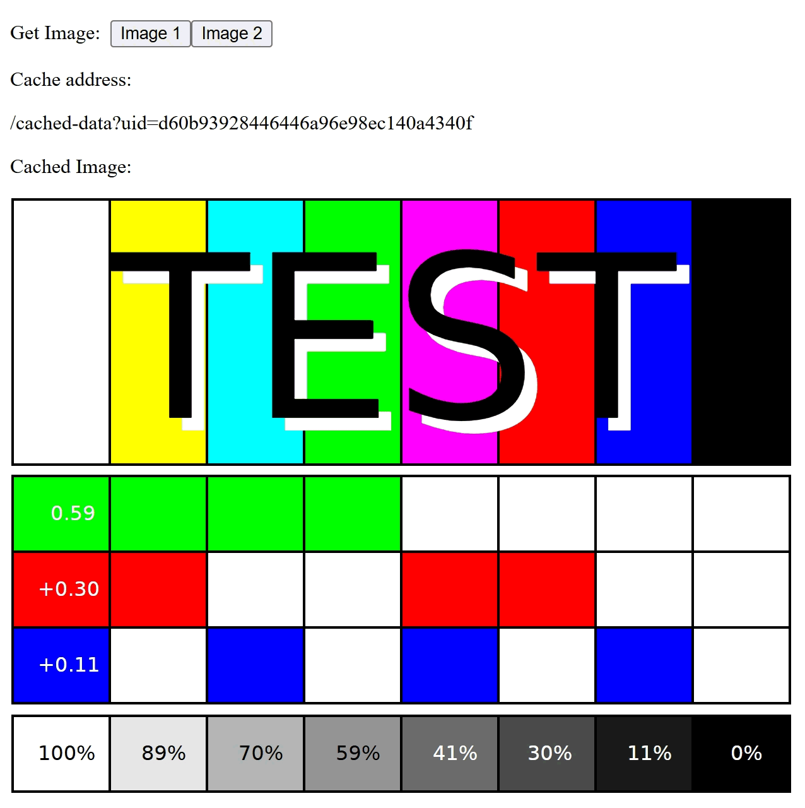

import IconExternalLink from "@theme/Icon/ExternalLink";

import mdiLanguagePython from "@iconify-icons/mdi/language-python";

import {demoURL} from "@site/src/envs/variables";
import DarkButton from "@site/src/components/DarkButton";

# Example of change dynamically loaded images

<div className="float-right indark-inv">

|                Example of dynamically loaded images                |
| :----------------------------------------------------------------: |
|  |

</div>

Check the following link to review the demo of changing the displayed image.

<p>
  <DarkButton to={demoURL("change_image.py")} icon={mdiLanguagePython}>
    {"change_image.py"}
  </DarkButton>
</p>

This demo provides the following features:

1. Provide two buttons: <kbd>Image 1</kbd> and <kbd>Image 2</kbd>.
   1. By clicking <kbd>Image 1</kbd>, the image will be replaced by the first image.
   2. By clicking <kbd>Image 2</kbd>, the image will be replaced by the second image.
2. When the button is clicked, the address of the cached data and the loaded image
   will be displayed.
3. By default (if the image is refreshed), the current image will be reset to the first
   image.

## Define the layout

The implementation of the layout contains two buttons and two outputs.

```python showLineNumbers
html.Div(
    (
        html.Div(
            html.P(
                (
                    html.Span("Get Image:", style={"paddingRight": "0.5rem"}),
                    html.Button(id="btn-img1", children="Image 1"),
                    html.Button(id="btn-img2", children="Image 2"),
                )
            )
        ),
        html.Div((html.P("Cache address:"), html.P(id="addr"))),
        html.Div((html.P("Cached Image:"), html.Img(id="cache"))),
    ),
)
```

By clicking any of the two buttons, the address (`addr`) and the image (`cache`) will
be reloaded.

Although the default value of the `html.Img` component is not configured, when
refreshing the page, the displayed image will not be empty but the first image.
That's because the default value of the image component is configured by the callback.

## Define the callbacks

The callback accepts the button clicks as the inputs. According to the id of the clicked
button, the path of the image to be loaded will be different. The service method
`self.service.register(...)` takes image path and the file information as the input,
and return the address that can be used to access the image.

```python showLineNumbers
@app.callback(
    Output("addr", "children"),
    Input("btn-img1", "n_clicks"),
    Input("btn-img2", "n_clicks"),
    # highlight-next-line
    prevent_initial_call=False,
)
def click_get_image(
    n_clicks_img1: Optional[int],
    n_clicks_img2: Optional[int],
):
    prop_id = str(dash.callback_context.triggered[0]["prop_id"])
    if prop_id.startswith("btn-img1") and n_clicks_img1:
        file_path = os.path.join(self.root, "test_image.svg")
    elif prop_id.startswith("btn-img2") and n_clicks_img2:
        file_path = os.path.join(self.root, "test_philips_PM5544.svg")
    else:
        # highlight-next-line
        file_path = os.path.join(self.root, "test_image.svg")
    addr = self.service.register(
        file_path,
        content_type="image/svg+xml",
        mime_type="image/svg+xml",
        one_time_service=True,
    )
    return addr
```

This callback is configured to be fired when the application is initialized (see the
option [`prevent_initial_call`<IconExternalLink/>][link-prevent-initial-call]). In this
case, `prop_id` will be `.` and the loaded image will be `test_image.svg`.

The returned value of the callback will be an address like this

```
/cache-data?uid=...
```

This address will be used to fire another callback subsequently, the definition of the
next callback is:

```python showLineNumbers
@app.callback(
    Output("cache", "src"),
    Input("addr", "children"),
    prevent_initial_call=True,
)
def update_cache(addr):
    if not addr:
        return dash.no_update
    return addr
```

This callback will forward the address to the `src` property of the image component if
the address is not empty. In other words, the source address of the image will be
finally configured as `/cache-data?uid=...`.

When the address of the image gets updated, since the component is read by the browser,
the browser will instantly access this cache address, which triggers the loading of the
data, thus letting users accept the data from `flask.stream_with_context`.

[link-prevent-initial-call]: https://dash.plotly.com/advanced-callbacks#prevent-callback-execution-upon-initial-component-render
