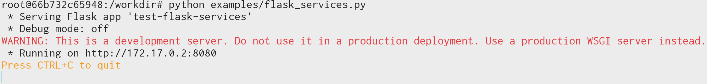

import mdiLanguagePython from "@iconify-icons/mdi/language-python";

import { demoURL } from "@site/src/envs/variables";
import DarkButton from "@site/src/components/DarkButton";

# Example of pure Flask services

Check the following link to review the demo of the pure Flask application.

<p>
  <DarkButton to={demoURL("flask_services.py")} icon={mdiLanguagePython}>
    {"flask_services.py"}
  </DarkButton>
</p>

This demo provide the following services:

| Service | Method | <center>Input arguments</center> | <center>Returned value</center>                                                              |
| :-----: | :----: | :------------------------------- | :------------------------------------------------------------------------------------------- |
|   `/`   | `GET`  | -                                | `{files: ...}`, where `files` is a list of file keys that can be used for accessing `/file`. |
| `/file` | `GET`  | `?name=...`                      | The metadata of the file to be downloaded.                                                   |
| `/file` | `POST` | `?name=...`                      | `{addr: ...}`, where `addr` is the address of the cached data.                               |

Therefore, the usage of this demo can be divided into three steps:

1. Use `/` to get the list of available files. Pick any one of the file key as the argument `name=...`.
2. Use `/file`, the `POST` method, and the file key acquired from the step 1 to get the cached file address.
3. Access the cached file address by the browser or any kind of downloader.

## Script for fetching the address of the file

Since it is not convenient to submit a `POST` request by the browser, we provide the following script to
help users get the cached file address of the first file on the file list. This script is written by the
Python Standard Library.

```python title="get_file_addr.py" showLineNumbers
from urllib import request
from urllib import parse
import json


def get_cached_file_addr(base_addr: str, idx: int = 0) -> str:
    """Get the address of the cached file for the demo `flask_services.py`

    Arguments
    ---------
    base_addr: `str`
        The base address like `http://xx.xx.xx.xx:8080`

    idx: `int`
        The index of the file to be accessed.
    """

    file_list = json.loads(
        request.urlopen(request.Request(parse.urljoin(base_addr, "/"), method="GET"))
        .read()
        .decode()
    )

    file_name = file_list["files"][idx]

    file_addr = json.loads(
        request.urlopen(
            request.Request(
                parse.urljoin(base_addr, "/file")
                + "?name={0}&download=true".format(file_name),
                method="POST",
            )
        )
        .read()
        .decode()
    )

    return parse.urljoin(base_addr, file_addr["addr"])


if __name__ == "__main__":
    import sys

    base_addr = str(sys.argv[1])
    idx = int(sys.argv[2]) if len(sys.argv) >= 3 else 0

    print(get_cached_file_addr(base_addr, idx))
```

After getting this script, please run the demo first:

```shell
python flask_services.py
```

<div className="indark-inv">

|                  Run the demo `flask_services`                  |
| :-------------------------------------------------------------: |
|  |

</div>

Leave the application running, and open another console window. Copy the address
displayed on the previous console window, and use the address with the script like this:

```shell
python get_file_addr.py http://172.17.0.2:8080
```

It will show the address of the first cached file as follows:

```
http://172.17.0.2:8080/cached-file?uid=...&download=True
```

Copy this address to the browser and hit the <kbd>Enter</kbd> button, the file will be
downloaded.

## Implementation of this example

The core implementation of this example is the part where we define the services. The
first serivce `/` is defined as follows:

```python showLineNumbers
@app.route("/", endpoint="index")
    def index():
        return flask.jsonify({"files": self.list_files()})
```

where `self.list_files()` is the list of file keys that can be used.

The second serivce contains the implemenation of `GET` and `POST` methods.

```python showLineNumbers
@app.route("/file", methods=["GET", "POST"], endpoint="file")
def file_config():
    file_name = request.args.get("name", type=str)
    if file_name is None:
        raise TypeError(
            'Needs to specify the argument "name" when accessing this API.'
        )
    if file_name not in self.files:
        raise FileNotFoundError(
            'The requeste file name "{0}" does not exist in the file '
            "list.".format(file_name)
        )
    if request.method == "GET":
        return flask.jsonify(self.files[file_name])
    elif request.method == "POST":
        file_item = self.files[file_name]
        use_download = request.args.get("download", type=bool, default=False)
        addr = self.service.register(
            file_item["path"],
            content_type=file_item["content_type"],
            mime_type=file_item["mime_type"],
            one_time_service=True,
            download=use_download,
        )
        return flask.jsonify({"addr": addr})
    else:
        raise MethodError(
            "The requested method {0} is not supported.".format(request.method)
        )
```

If the `GET` method is accessed, only the file metadata will be returned. The file will
not be loaded in the cache. In this guide, we do not use this feature.

The `POST` method accept one required argument `name` and an optional argument
`download`. The `name` will be used for getting the path of the file on the server,
and the returned address will be provided by the `self.serivce.register(...)` method.
By calling this method, the data will be loaded by the cache.
